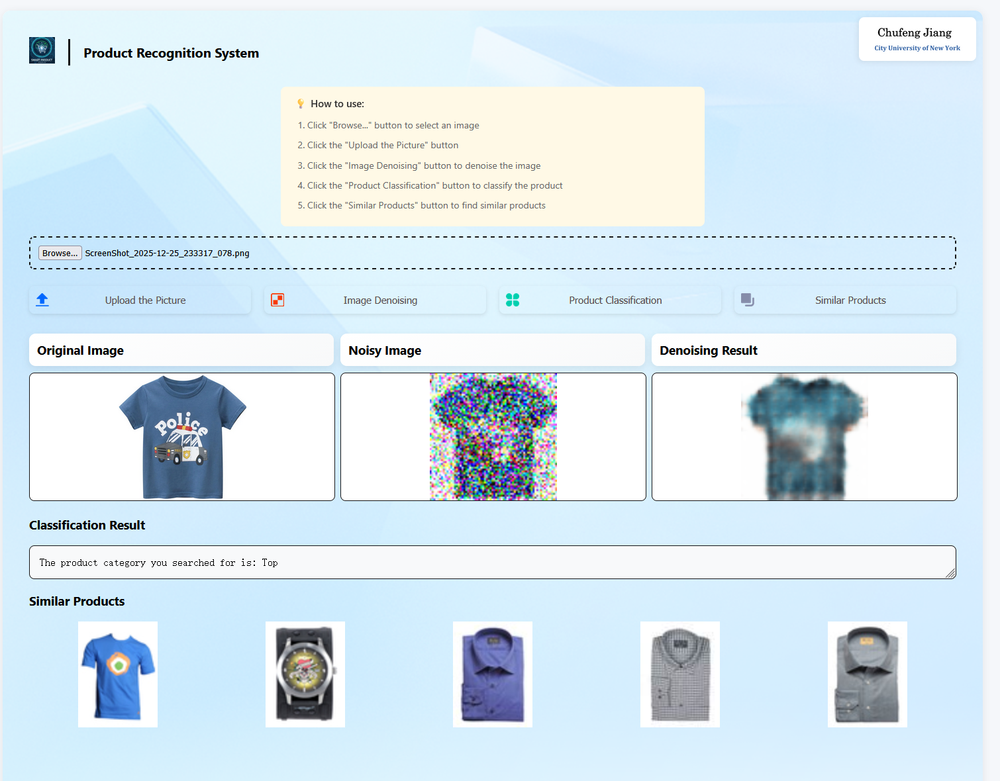

[](https://chufengjiang0321-smart-product-recognition.hf.space)

# Overview

SmartProduct AI Vision is a comprehensive deep learning-powered system for intelligent product recognition, integrating three core computer vision capabilities: similarity search, image denoising, and product classification. Built with PyTorch and Flask, it offers an intuitive web interface for seamless user interaction.

## 🌐 Live Demo

<div align="center">
   <a href="https://chufengjiang0321-smart-product-recognition.hf.space" target="_blank">
    
  </a>
  <a href="https://chufengjiang0321-smart-product-recognition.hf.space" target="_blank">
    
  </a>
  <br>

</div>

## ✨ Core Features

### 🔍 **Product Similarity Search**

- Upload a product image to find the top 5 visually similar products from the database
- Uses advanced deep learning embeddings for accurate visual matching

### 🛠️ **Image Denoising**

- Automatically adds simulated random noise to uploaded images
- Demonstrates denoising capabilities with before/after visual comparisons
- Enhances image quality for better downstream processing

### 📊 **Product Classification**

- Automatically identifies and categorizes products in uploaded images
- Supports multiple product categories with high accuracy

## 🏗️ **Project Structure**

```
smartproduct-ai-vision/
├── image_denoising/          # Image denoising module
├── image_classification/     # Product classification module
├── image_similarity/         # Similarity search module
├── app.py                    # Flask web application
└── README.md                 # This file
```


## 📋 **Prerequisites**

- Python 3.10+
- PyTorch 1.8+
- Flask 2.0+
- CUDA-capable GPU (recommended for faster inference)


## ⚙️ **Installation**

1. **Clone the repository**

```
git clone https://github.com/Chufeng-Jiang/Smart_Product_Recognition_AI_Vision
```


1. **Create virtual environment**

```
python -m venv venv
source venv/bin/activate  # On Windows: venv\Scripts\activate
```


1. **Install dependencies**

```
pip install -r requirements.txt

or

conda create -n image_similarity_main python=3.12
conda activate image_similarity_main
pip config set global.index-url https://pypi.tuna.tsinghua.edu.cn/simple
pip3 install torch torchvision torchaudio --index-url https://download.pytorch.org/whl/cu126
pip install matplotlib
pip install pandas
pip install tqdm
pip install flask
pip install scikit-learn
```


## 🚦 **Quick Start**

1. **Launch the Flask application**

```
python app.py
```

1. **Access the web interface**

   - Open your browser and navigate to `http://127.0.0.1:7860/`

2. **Using the system**

   - Upload an image through the web interface

   - Choose from three available functionalities

   - View results in real-time


     
